# Wwise 2016.2 新发布纵览

全球的 Wwise 用户已经习惯了 Wwise 每年一至两个大版本的发布周期。每个大版本都会在听取互动音频圈的需求基础上，推出新功能和已有功能的改进。Wwise 2016.2 是 2016 年内的第二个大版本，2016.1 版推出了全新 Ambisonics 管线，而这次我们把注意力主要放在已有流程的改善上，希望透过这些更新，让无论是游戏还是 VR 用户都能喜欢这些新变化，体会到我们的诚意。这篇综述写在技术性的[发布说明](https://www.audiokinetic.com/library/edge/?source=SDK&id=releasenotes.html)和面向 Wwise 老手的[官方综述](https://www.audiokinetic.com/library/edge/?source=SDK&id=whatsnew__2016__2__new__features.html)基础上，希望能帮助用户更直观地理解这些改进。内容组织为以下几个类别：

- 设计
- 调试和性能优化
- 插件
- 安装与维护

# 设计

## 新的 Multi Editor 视图改进批处理

### 过去

虽然 Wwise 利用 Actor-Mixer 对象很好的解决了批量控制对象属性的问题，但当需要跨过多个 Actor-Mixer 子结构或者多个 Work Units 来批处理属性的时候，需要在 Project Explorer 里面选中多个对象再右击选择 Multi-edit，在弹出的 Multi-Editor 对话框中操作时，无法使用其它窗口界面功能，不方便同时试听，而且需要在树形结构中浏览查找属性内容：
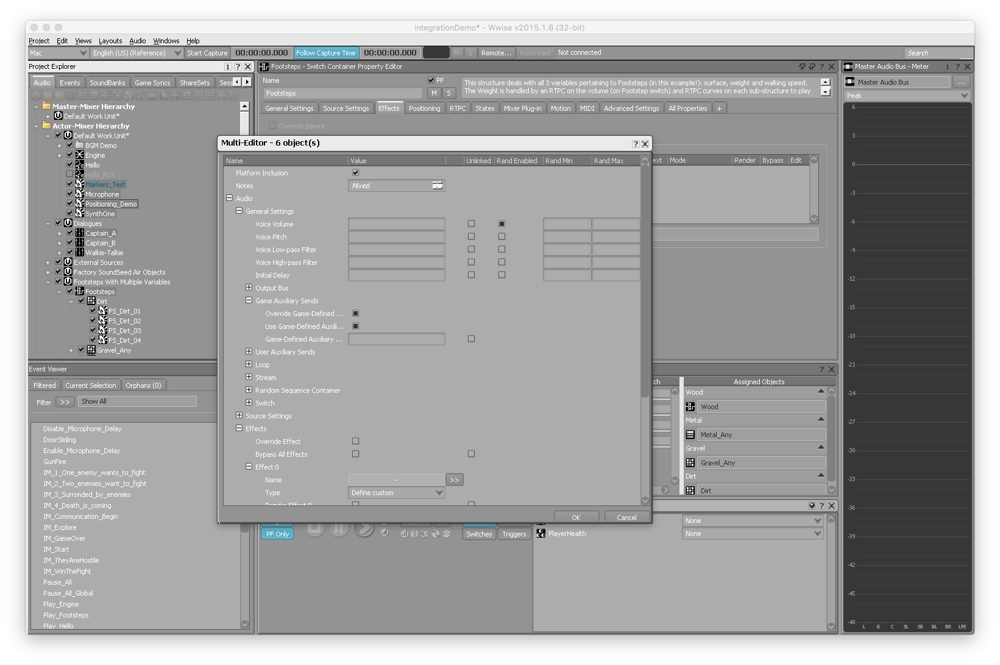

### 2016.2 版
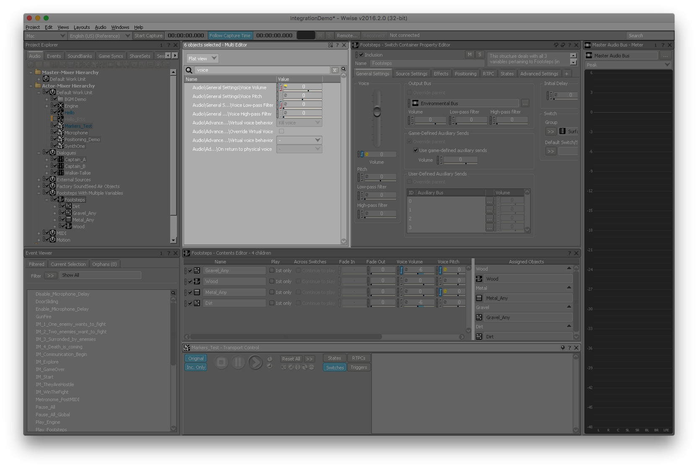

新的 Multi Editor 流程针对过去的问题做了如下改进：

- 新一代的 Multi Editor 成了一个全新的独立视图，可以浮动操作也可拖拽到界面布局中（见上图中的高亮区域），布置好后便不再需要额外鼠标点击；
- 新视图不会阻挡其它操作；
- 新 Multi Editor 有了关键字筛选功能（用列表右上角放大镜按钮打开），并且可以选择采用扁平视图或树形视图来显示条目，大大方便了属性定位，细心的用户也会发现，Wwise 中大部分列表视图现在都有了关键字筛选功能；
- 属性上的 RTPC 和 跨平台 Link 标志现在也能在 Multi Editor 中显示。

## 改进多平台定制对象层级的流程

### 过去 

如图中高亮所示，如果想从 Mac 平台的对象层级中弃用 Hello_RSX 这个对象，以前的流程是在平台下拉框中选中 Mac 平台，然后去掉目标对象左边的勾选：

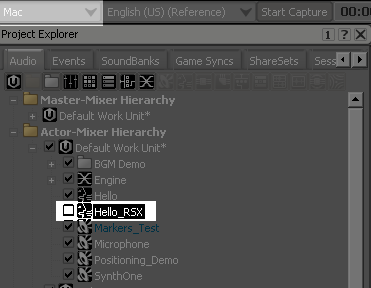

这时，如果再切换到别的平台（比如 PS4）工作了一阵，则容易忽略平台相关性，会很难发现或想起这些对象是不是平台相关：

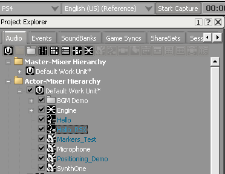

在做对象属性的多平台定制的时候，通过 Link／Unlink（链接该平台／取消链接该平台）机制用橙色标志醒目标明了“平台专用”的属性。这个机制和对象层级的定制如果统一起来就好了，可以让界面更清晰，流程更透明。

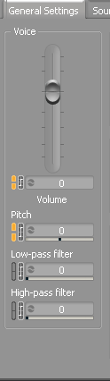

### 2016.2 版

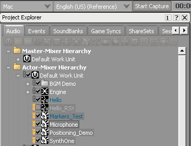

见上图，现在做对象层级的平台定制的时候，可以选中对象后批量做 Link / Unlink 操作，之后再通过勾选对象来对当前平台启用或弃用对象，结果也可从醒目的橙色标志看出。

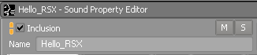

见上图，在对象的属性编辑器中，现在也能做同样的启用／弃用操作。

这项更新能让界面更易读，并且让工程中的各种多平台定制流程更统一。

## 在设计工具中直接播放原始音频

### 过去

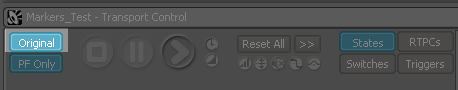

Wwise 的 Transport Control 一直用 Original 这个开关按钮来切换试听模式，点亮后播放的是未经转码的“原始”音频内容。但是，这里听到的“原始”内容还不是”素材文件“的原始录音，而是 Wwise 声音对象的声音，即考虑了素材所在 Wwise 对象上设置好的属性，包括 Voice Volume 等混音属性，所以当要试听对比引擎和原始素材文件的效果时，要想通过界面来忽略这些 Wwise 内的加工则并不容易。

### 2016.2 版

现在如果要快速试听原汁原味的素材，则可以在键盘上按住 Shift 键后再播放目标对象，这样可以忽略对象上的所有 Wwise 属性。

## 改进按表格文件导入素材的功能

### 过去

Wwise 已经提供了[模版功能](https://www.audiokinetic.com/library/edge/?source=Help&id=using_template_to_import_media_files)来复用对象结构设计，实际中[用户也早已采用了各种手法来活用模版](http://blog.audiokinetic.com/using-templates-in-wwise)。但还有一个较少提到的大规模复用手段是 [Tab-delimited Import](https://www.audiokinetic.com/library/edge/?source=Help&id=importing_media_files_from_tab_delimited_text_file)，即在一份表格中采用 Wwise 支持的格式写法配置好素材与导入后 Wwise 对象结构、属性和事件等设计内容，然后在 Wwise 中导入这份表格文件，即可自动生成上述设计内容，这对在项目之间复用设计会很有用。

### 2016.2 版

现在表格导入功能已支持添加 Game Syncs 比如 Switch／State，以及 Dialogue Event 的分支路径，并可以通过一直以来 Wwise 自带的[命令行程序 WwiseCLI](https://www.audiokinetic.com/library/edge/?source=SDK&id=bankscommandline.html) 来导入，这样可以很好的集成到项目自动化管线中去。

未来还将加入自动创建总线结构的功能。

## 新增存取容器播放历史的 API

### 过去

容器播放历史特别是随机容器的播放历史以往是不可保存的，但有时候我们会希望在绝对随机和绝对重复的极端情况之间，能根据具体播放历史找到更灵活的控制手段，比如选择性地记录连续模式下随机容器的播放序列“快照”并重复它一两次。

### 2016.2 版

Wwise SDK 新增了 API 来实现记录容器播放历史:

- [AK::SoundEngine::GetContainerHistory()](https://www.audiokinetic.com/library/edge/?source=SDK&id=namespace_a_k_1_1_sound_engine_a95f58451e84d93b44b499879f64efd90.html)
- [AK::SoundEngine::SetContainerHistory()](https://www.audiokinetic.com/library/edge/?source=SDK&id=namespace_a_k_1_1_sound_engine_afe570786b88d70d7ad05845efd03371f.html#afe570786b88d70d7ad05845efd03371f)

# 调试与性能优化

## Profiler 中可监视 API 调用

### 过去

Wwise Profiler 已经可以为设计师和程序员实时提供大量的调试信息和性能分析结果，同时 Wwise 音频程序员的工作量已经大大降低。对于具体的程序 API 调用信息，比如一个使用 Game-defined 3D 定位的典型 3D 游戏中，需要根据游戏对象在不同空间区域的位置来切换区域的混响效果，这是由程序[根据对象位置调用辅助发送 API](https://www.audiokinetic.com/library/edge/?source=SDK&id=soundengine__environments.html) 来实现的，这个操作的时机在之前版本的 Profiler 中可以通过观察辅助发送相关的信息比如 Advanced Profiler 视图中的Game-defined Sends 和 Voice Graph 来间接捕捉（见上图）。

### 2016.2 版

2016.2 的 Profiler 引入了 API 监控功能，在 Capture Log 中可以看到调用时机和参数（如图中所示，辅助发送 API 的细节已被高亮显示）；另外在 Advanced Profiler 中新增了 API Calls 选项卡，结合 Performance Monitor 的时间线可以统计任意时刻上的各种 API 调用次数。在 Capture Log 的 Filter 中可以筛选需要显示的 API 类型。

## 改进了 Capture Log 的信息筛选配置界面

### 过去

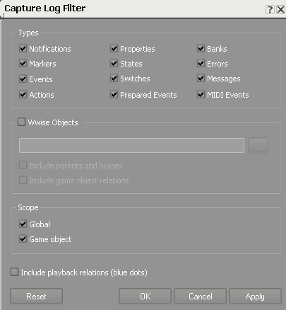

Profiler 的 Capture Log 中已经支持通过 Filter 筛选显示信息，但需要逐个浏览勾选或去掉勾选。

### 2016.2 版

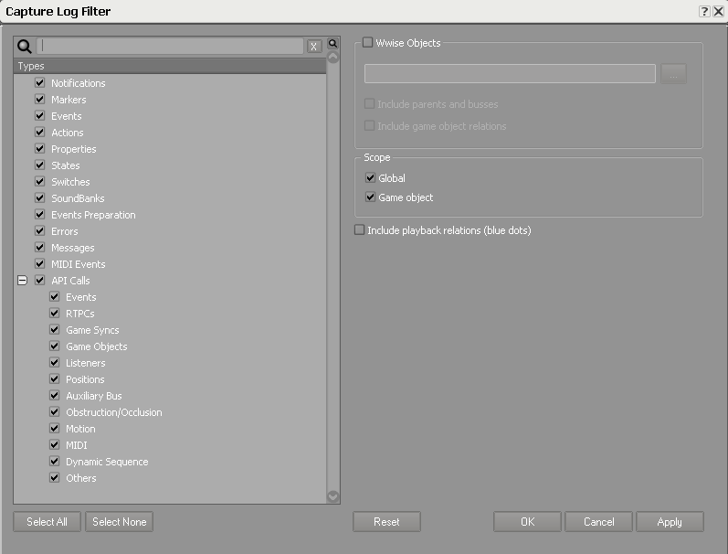

上面是全新的筛选器界面，Select All 和 Select
 None 按钮让选择或排除少数条目更容易，同时条目用列表形式也更易浏览，并支持关键字筛选。

## Profiler 中可对 Game Objects 做 Mute 和 Solo

### 过去

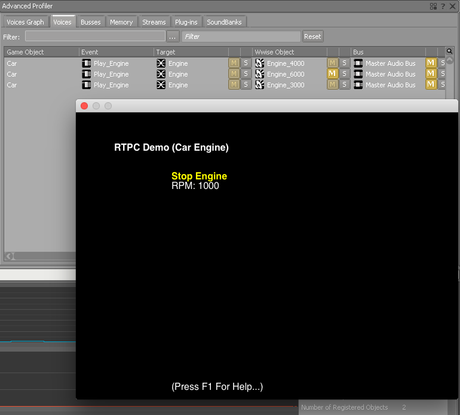

Wwise Profiler 可以联机监控游戏中的完整声音实况，包括游戏和应用中发声体对象（[Game Object](http://gad.qq.com/article/detail/7168056)）的活动，也可以实时 Mute／Solo [声音对象](https://www.audiokinetic.com/library/edge/?source=Help&id=actor_mixer_objects_sound_objects)和 [总线](https://www.audiokinetic.com/library/edge/?source=Help&id=master_mixer_objects_master_mixer)（见上图 Integration Demo 应用中 RTPC Demo下的情况）。但有时要单独监测一个游戏对象，比如混战中某个角色的声音平衡，而同一场景下含有这些声音的其它对象则会形成干扰，此时设计师如果想 Mute／Solo 涉及的角色 Game Object，则需要间接通过 Mute／Solo 总线来做到。

### 2016.2 版

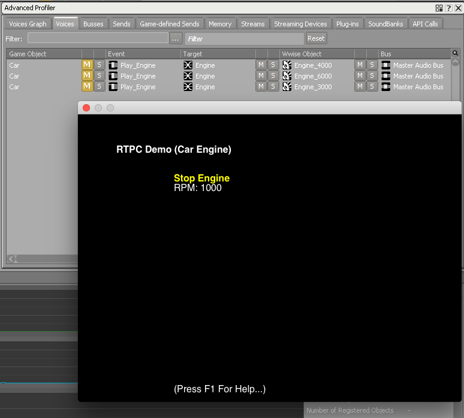

现在简单了！同样在 Advanced Profiler 的 Voices 选项卡中，现在可以直接 Mute／Solo 任何 Game Object，精准监控每一个游戏对象。

## 更多属性可在 Profiler 中实时调整

### 过去

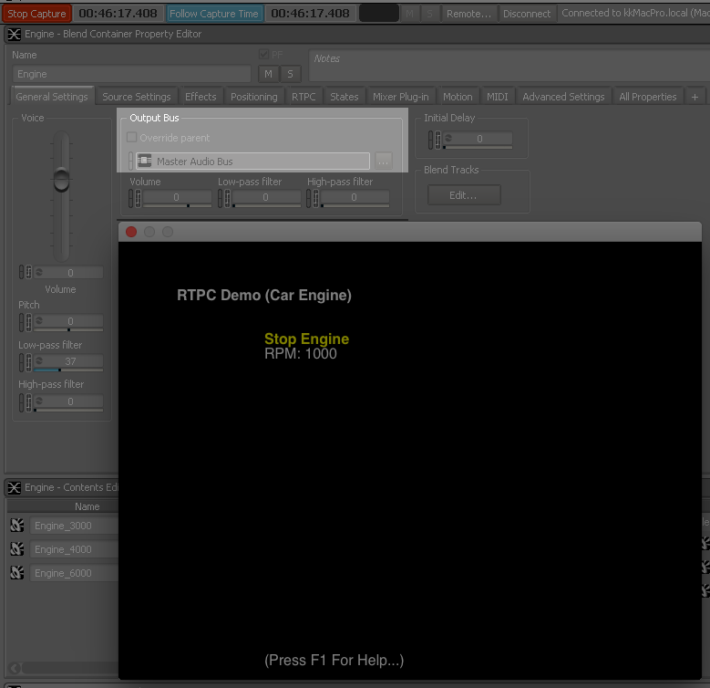

Wwise Profiler 支持实时调试和混音的参数虽然可以满足大量需求，但联机时不能实时切换对象的输出总线（Output Bus）。从上图中可以注意到：过去 Output Bus 属性的浏览功能在联机中禁用。

### 2016.2 版

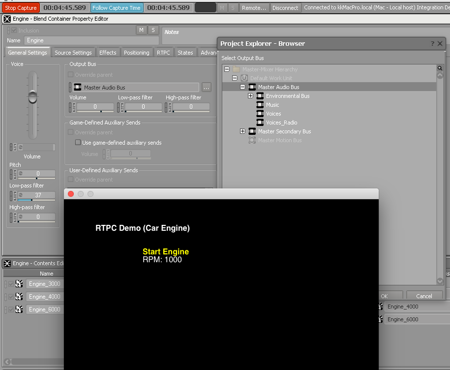

现在则可以在联机时调整更多的参数，包括实时切换输出总线，这进一步扩大了实时混音调试的自由度。其余新增可调参数参见[发布说明](https://www.audiokinetic.com/library/edge/?source=SDK&id=releasenotes.html)。

## List View 中查看媒体和对象结构的内存占用大小

### 过去

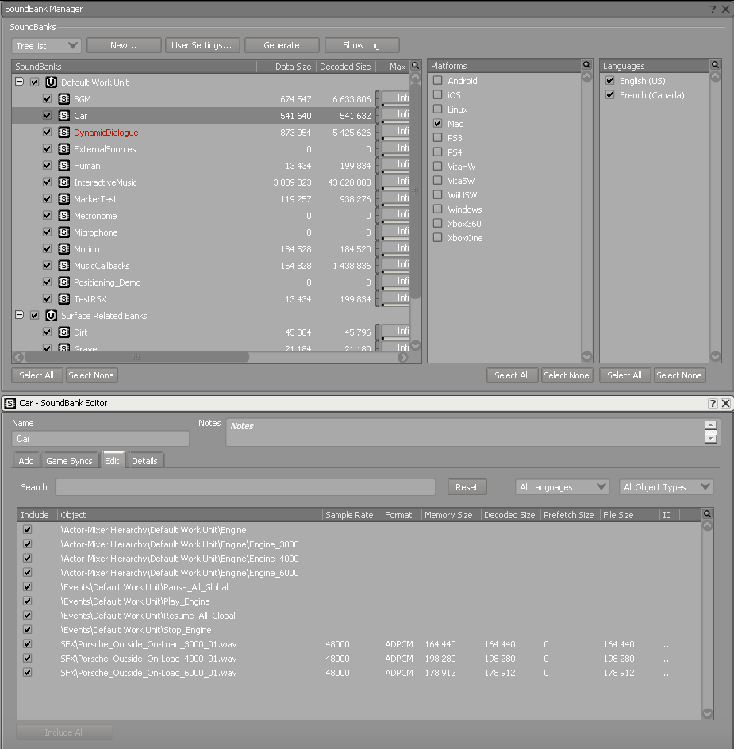
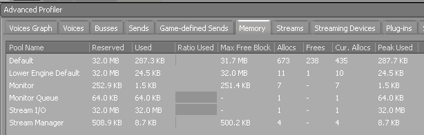

以往在 SoundBank Manager 和 Conversion Settings 中可以查看 SoundBnak 和声音媒体数据的内存占用大小，并且我们知道声音对象结构本身占用内存远远小于媒体数据，不过却没有办法确切知道各个对象结构本身占用的内存大小，只能联机后通过 Advanced Profiler 中的 Default Pool（默认内存池）占用大小来估计工程中全体对象结构和事件（不含媒体数据）所占用的总大小。

### 2016.2 版

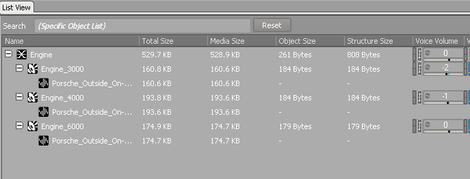

对内存需要明察秋毫的用户一定会喜欢这个新功能：在可以批量查看和编辑对象的 List View 以及 Query 和 Reference View 中，现在即使不生成 SoundBank 也可以看到对象及其下属结构的内存占用。媒体内存大小由于与转码设置相关，仍然需要转码或者生成 SoundBank 后才可看到。

## 改进对象层级的播放数限制规则

这个改进虽然很微妙，但对 CPU 相关的 Voice（声部）性能分析和优化非常重要，所以需要多一点解释。依然以 Integration Demo 中 RTPC Demo 用到的汽车发动机的容器结构 Engine 为例。

### 过去

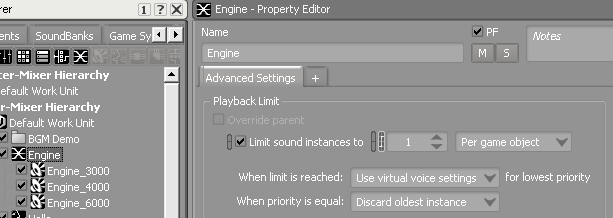
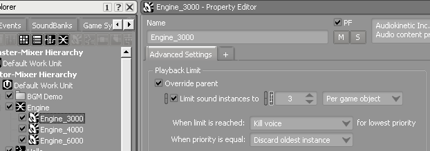

过去，如果采取上图中的设置，即：

- 将顶层对象 Engine 这个容器的 Playback Limit 设为 1，并将超出的对象送往 Virtual Voice；
- 子对象 Engine\_3000 这个 SFX 对象设为 Override Parent（不沿用父对象），并将其 Playback Limit 设为 3，并终止超出的播放实例；
- 剩余两个子对象沿用 Engine 父对象的设置。

则在实际播放 Engine 的过程中，打开 Capture 并转到 Profiler 布局会得到下图的结果：

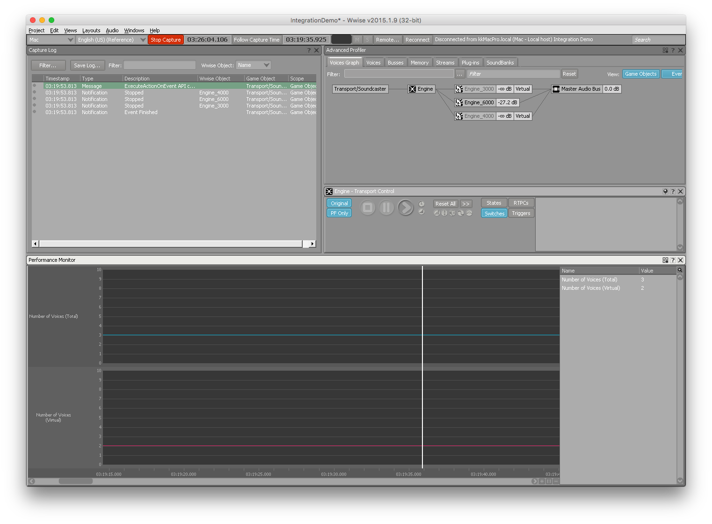

可以观测到总 Voice 数为 3，其中有 2 个 Virtual Voice，分别是 Engine\_3000 和 Engine\_4000，仍然听得到的 Voice 是 Engine\_6000。那么问题来了：

- 既然 Engine\_3000 已经“绕过了”父对象，为什么似乎依然被纳入了父对象 Engine 值为 1 的播放数限制而变成了 Virtual Voice 呢？

原因在于，过去 Wwise 的播放数限制（Voice Limiting）有两条宏观规则：

- 工程中对每个声音对象有三重播放数限制：Project Settings 中的平台总限制；该 Voice 流经总线层级上的 Playback Limit；该 Voice 所在 Acter-Mixer 层级上的 Playback Limit。
- 在上面的后两重限制中，每一重只允许一个 Playback Limit 起作用！只允许一个 Limit！一个 Limit！（重要的事说三遍）

也就是说在上面的例子中，子对象的 Override Parent 并不能在*播放父对象* Engine 的情况下起作用。这样的规则虽然说得通，但不直观，用户会希望在 Override 子对象的时候“忽略”父对象的设置，也即让子对象的这个设置无论如何都生效。

### 2016.2 版

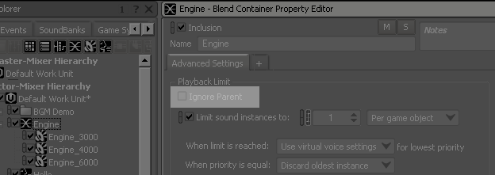
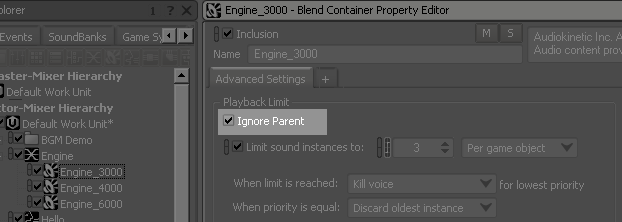

现在，看起来基本上还是和过去一样的设置，而界面上只有一处变动，即过去的 Override Parent 字面上变成了 Ignore Parent（忽略父对象）。然而背后的变化是喜人的，现在播放数限制的宏观规则是：

- 工程中对每个声音对象的三重播放数限制依然有效，和从前一样；
- 但后两重限制中，每一重都允许任意数目的 Playback Limit 起作用！允许任意数目的 Limit！任意数目的 Limit！方法就是启用 Ignore Parent。

于是在实际播放 Engine 的过程中，打开 Capture 并转到 Profiler 布局会得到下图的结果：

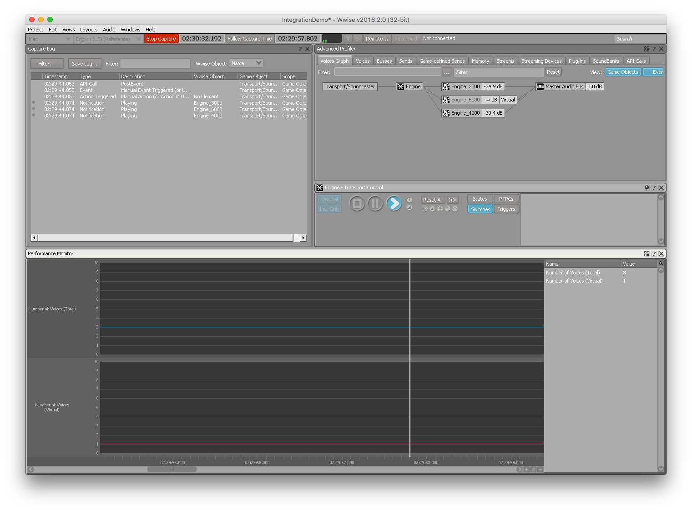

可以观测到这次总 Voice 数依然为 3，但变为只有 1 个 Virtual Voice，即 Engine\_6000，另外两个子对象包括 Engine\_3000 成了实 Voice，只有 Engine\_4000 是父对象播放数限制的产物。而当去掉 Engine_3000 的 Ignore Parent 勾选后，实际结果与上述过去的例子结果会是一样的，大家可以自行尝试。

这个更新使得界面元素和规则都更加直观合理，比从前更清楚地规定了层级结构中播放数限制上继承与不继承的用法。注意，在总线结构中，播放数限制也遵守这个规则，也就是说 Actor-Mixer 层级结构中对象的 Ignore Parent 只会忽略 Actor-Mixer 层级结构中的父对象，再往上还是要遵循总线结构的同样规则。

谨慎的老用户可能会问：过去版本里创建的 Wwise 工程升级过来的话，以前的 Playback Limit 设置会不会出乱子？

答案是：不用担心，可以无缝升级，过去的行为会完好保留并在界面上体现出来。

## 新增 Virtual Voice 行为来简化批量设置

### 过去

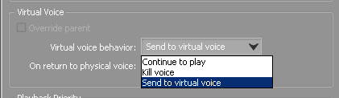

Wwise 的 [Virtual Voice](https://www.audiokinetic.com/library/edge/?source=WwiseProjectAdventure&id=understanding_virtual_voice_behavior) 是优化 CPU 的主要手段之一，也能够间接帮助动态混音，以往设计师已经利用这个功能大大减轻了程序员在优化上的负担。不过实战中用户有了一个常见的设计模式：只将氛围声和音乐等需要循环播放的对象在性能需要时送入 Virtual Voice（Send to Virtual Voice），并在 Virtual 期结束后续播；而将大量的单发（不循环播放）的音效在性能需要时直接终止（Kill Voice）。这个模式一贯需要根据涉及的对象循环与否来分别设定。

### 2016.2 版

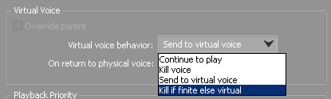

现在新增了针对这个常见设计模式的 Virtual Voice 行为选项：*Kill if finite else virtual*, 即“如果不是无限循环就终止，否则送 Virtual”，而对应从虚声部返回实声部的操作会自动设为 Play from Elapsed Time（即考虑了时间流逝的续播）。这样就可以更方便地进行批量操作而不用对不同对象分别设定了。

## 优化了 Blend Container 的性能

### 过去

Blend Container（混合容器）是 Wwise 中主要用于声音互动层叠的基本容器，比如车辆发动机声、天气（[《Witcher 3》Wwise 巡讲会 2016 视频](https://v.qq.com/x/page/k03205q33vu.html) 9:00-15:00）、[鱼群](http://blog.audiokinetic.com/abzu_game_audio)、[海浪](http://blog.audiokinetic.com/open-world-ambient-design-using-image-based-parameters)等等。但如果仍用 Integratoin Demo 的 RTPC Demo 为例，在下图的 Blend Track 中，当 RPM 这个 RTPC 为 3000（如下图）时：

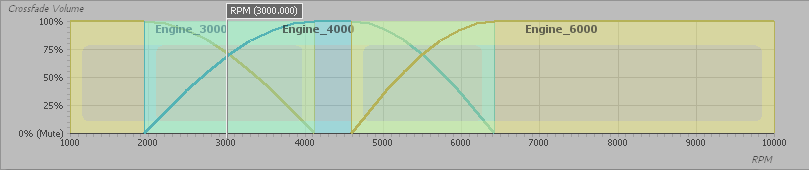

如果打开 Capture 在 Advanced Profiler 里观测，会看到：

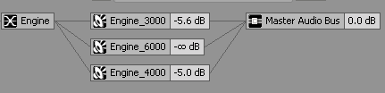

也即虽然在 Blend Track 内 RPM 并没有触及 Engine\_6000 代表的区间，默认设置下 Blend Container 依然会播放其内装的全部三个 SFX 对象，只是 Engine_6000 处于静音状态。在过去版本中，性能优化的标准做法是对 Engine 对象设置 Send to Virtual Voice 选项，之后则会看到：

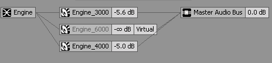

这样 Engine_6000 在 Virtual Voice 中将不再消耗播放 CPU。但有人不禁会问，可不可以等 RPM 升到了 Engine\_6000 对应区间再开始播放它，而其余时候压根就不播放呢？

### 2016.2 版

为此，最新的 Blend Container 和其它容器一样有了两个播放模式：*Step* 和 *Continuous*。

采用了 Continuous 模式之后，与上面的例子一样的设定之下，打开 Capture 在 Advanced Profiler 里观测，会看到：

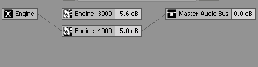

可以发现这次 Engine\_6000 没有播放，只有在 RPM 这个 RTPC 落入其 Blend Track 子区间后才会开始播放，于是在 Continuous 模式下我们如愿以偿地实现了 Blend Container 上进一步的性能优化。

注意，Engine 例子中的三个 SFX 都采用循环播放。在非循环播放情况下，Blend Container 在 Continuous 模式下即使播完之后也不会自动停止，而是会持续监视相关 RTPC，看其是否在 Blend Track 的不同区间之间发生了切换，当从一个区间切换到另一区间时便会再次触发该区间声音的播放。这点类似 Switch Container 的 Continuous 模式，只有显示发出停止播放的动作才会停止其播放。但监视 RTPC 期间由于依然是按需启动播放，所以不会浪费 Voice 资源。

Step 模式的行为和过去版本的行为一样：

- 播放容器时所有子对象同时开始播放；
- 不采用循环播放的情况下，播放完后自动停止。

注意，Step 模式依然有用武之地：如果在 Blend Track 中对应各区间的子对象需要保持同步的时候，则所有子对象应该同时启动，这时就需要用 Step 模式了。

## 优化了 Android 上的延迟控制和蓝牙支持

### 过去

安卓设备上的音频延迟是一个 Android 界的[普遍问题](https://qnalist.com/questions/6303392/opensl-audio-fast-path-and-bluetooth-output-issues)，而 Google 针对这个问题推出的 [Fast Audio Path](https://source.android.com/devices/audio/latency_design.html) 低延迟解决方案迟迟未得到所有厂商的支持，很多机型特别是启用蓝牙设备时会遇到相关问题（[来源 1](https://code.google.com/p/android/issues/detail?id=31556)，[来源 2](https://code.google.com/p/android/issues/detail?id=58265)，[来源 3](https://code.google.com/p/android/issues/detail?id=187917)）。针对这个问题的普遍建议是增大缓冲区以提高对延迟的容错，比如在 Wwise 中可以通过 AkPlatformInitSettings::uNumRefillsInVoice 控制。

### 2016.2 版

现在 Wwise 在针对 Android 平台上的蓝牙设备做了自动检测和优化以求改善延迟带来的问题，并在文档中对这个安卓界普遍问题的来龙去脉贡献了[详细的介绍](https://www.audiokinetic.com/library/edge/?source=SDK&id=pg__android__fastpath.html)以供音频圈参考。

# 插件

## McDSP 插件现换上了 DAW 用户熟悉的原版界面

Wwise 中的 [McDSP 插件系列](http://blog.audiokinetic.com/mcdsp)是很多用户喜爱的失真和限幅专用效果器。这次的更新见下面，不用多说了吧？

### 过去

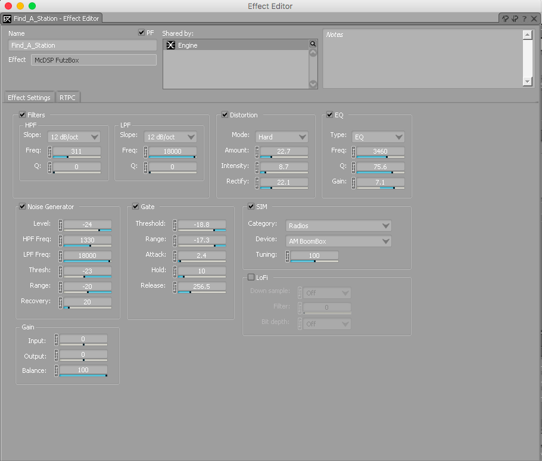

### 2016.2 版

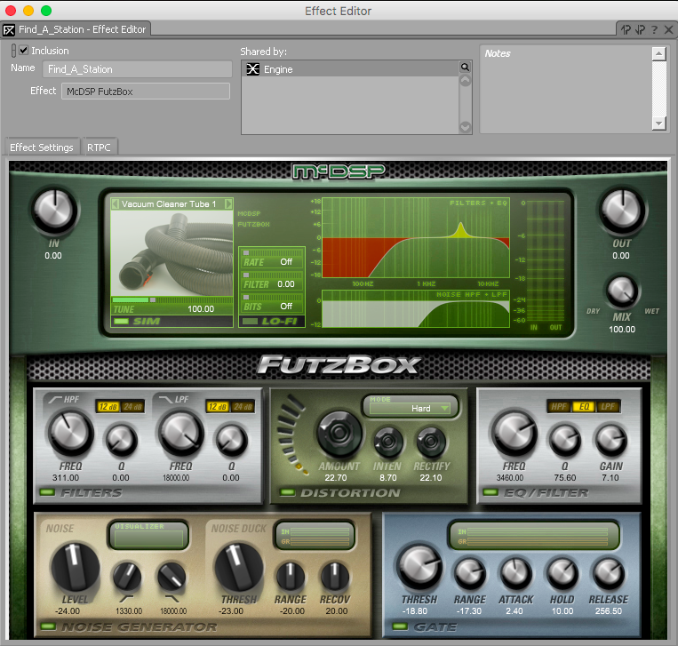

## Wwise Convolution Reverb 插件现支持 Ambisonic 和 多声道 IR

Wwise 卷积混响插件的这个更新是对 Ambisonic 管线流程的进一步巩固，Ambisonic IR 支持可旋转的混响效果，是 Spatial Audio 用户特别是 VR／AR 用户的福音。

## 新增 Microsoft HRTF 插件支持

Spatial Audio 方面，在 Auro-Headphones 以及其它第三方 Binaural 插件基础之上，Wwise 空间音频插件库又添一件利器：微软 HoloLens 的主打双耳声方案。

## 改进插件的开发支持

可以看到 Spatial Audio 研究领域是如此热闹和开放，而 Wwise 的成熟管线配上开放的混音插件（Mixer Plugin）以其灵活性和互动性引起了各界的兴趣，包括 Auro，VisiSonics，Impulsonic 在内的第三方音频厂商都针对 Wwise 的混音插件支持开发了空间音频插件。在 2016.2 版中，Wwise 接着这股东风为第三方插件开发进一步开放了管线：

- 为 Effect 和 Mixer 插件开放了新的底层服务；
- 为 Effect 插件 API 开放了 Ambisonics 编解码服务；
- Mixer 插件现在可以控制逻辑音量以利用 Wwise 的 Virtual Voice 机制。

希望这些改进能为第三方开发推波助澜，继续激发整个音频圈的创造力！

# 安装与维护

## Wwise Launcher 现支持统一管理 Unity 和 Unreal 引擎集成

说了这么多，心动的用户可能已经在下载 Wwise 2016.2 版了，而第一个体验到的改进就是这里最后提到的 Wwise Launcher。

### 过去

在 2016 上半年推出 Launcher 之前，用户需要自行登录网站挑选下载合适的 Wwise 版本 以及 Unity 和 Unreal Engine 集成版本。最近用户可能已经体验到了用 Launcher 管理 Wwise 版本、工程和学习资源的便利性，所以就更加期待能用 Launcher 实现对 Unity 和 Unreal 集成的一体化管理。

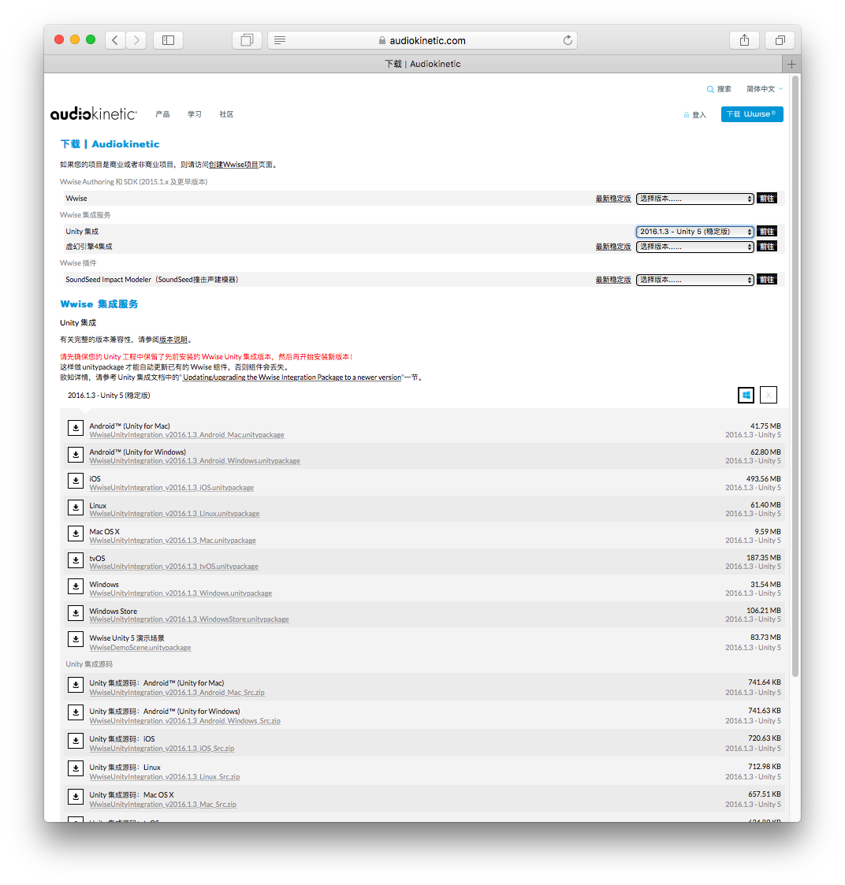

### 2016.2 版

这一天来了！现在在 Unity 选项卡下 Launcher 会找到电脑上已有的 Unity 和 Unreal 工程，用户可以直接为工程点选安装或升级 Wwise 集成，也可以打开这些 Unity 或 Unreal 工程和 Wwise 工程：

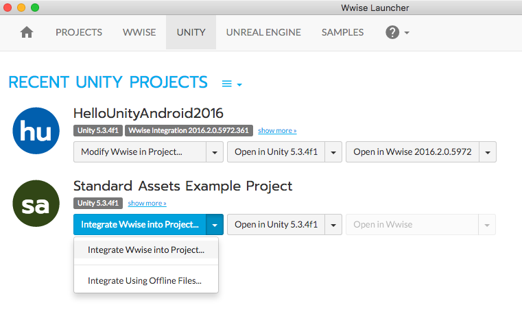

在安装向导中可以方便地选取集成版本、目标平台和各种路径：

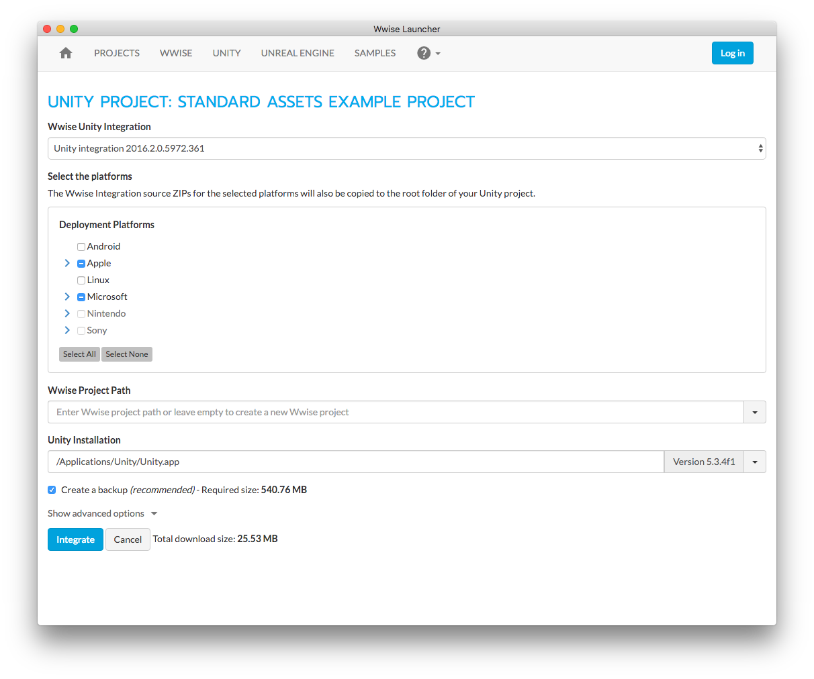

在通过 Launcher 安装 Unity 集成之前，Launcher 会就地自动备份原有的工程文件夹。

# 结语

Wwise 在诞生 10 周年之际推出了全新的 Ambisonics 管线和其它面向 VR／AR 的 Spatial Audio 支持，但从 2016.2 中可以看出，Wwise 并不是只追随“高大上”的热点，而是始终谋求为互动音频用户提供更大的控制权和更透明的流程，希望大家能喜欢这次发布并给我们反馈。
