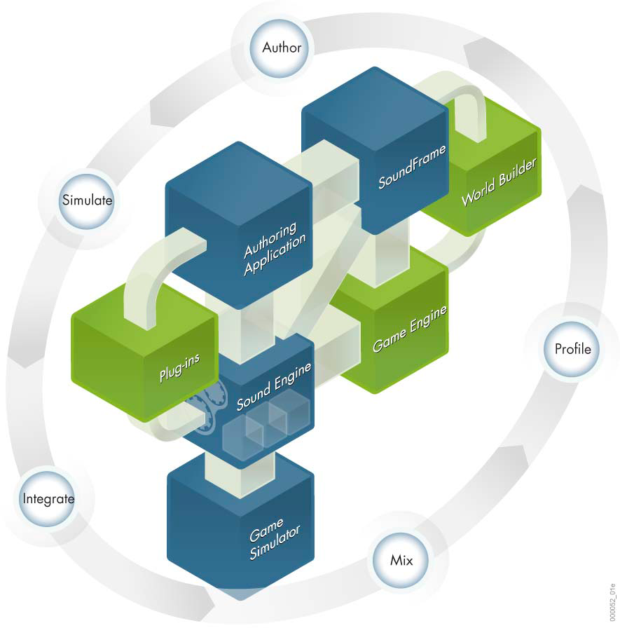
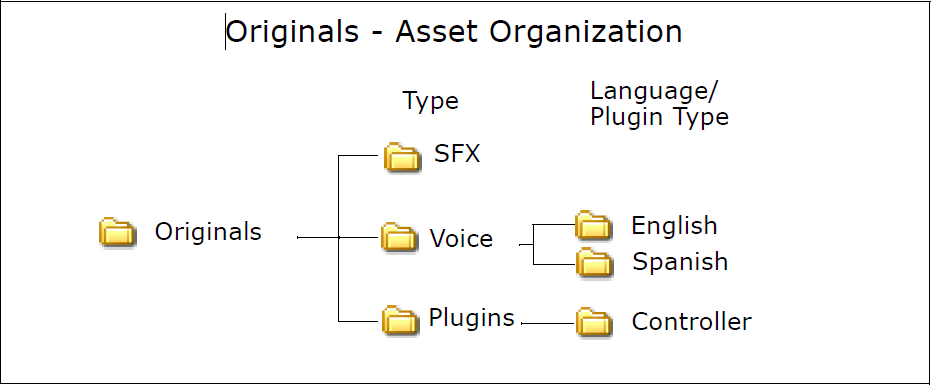

# Wwise 基础知识 (1) Wwise 简介

内容简介

- Wwise 简介 
- Wwise 制作管线
- Wwise 工程
- Wwise 如何管理工程中的素材
 - Originals 文件夹
 - 平台版本

## Wwise 简介
在深刻认识到声音设计师和音频程序员需求的基础上，Audiokinetic 创建了创新的专业音频设计解决方案 Wwise。经过多年的发展，Wwise 在开发中遵循了以下理念：

- 提供完整的制作解决方案。
- 重新定义音频和振动（motion）的制作工作流程。
- 提高管线效率。
- 使用音频和振动拓展游戏沉浸体验。

这款强大全面的音频管线解决方案包括以下部分：

- 强大的创作应用程序——非线性创作工具，用于创建音频和振动素材结构，定义传播，管理声音、音乐和振动集成，分析播放性能，以及创建 SoundBank（声音库）。
- 创新的声音引擎——先进的声音引擎，用于管理音频和振动处理，执行全面的多样化功能，并针对每款平台进行了高度优化。
- Game Simulator（游戏模拟器）——LUA 脚本解释器，用于准确再现声音和振动在游戏中的运行情况，使您能够先验证 Wwise 在每款平台上的特定行为和分析其性能，然后再将 Wwise 集成到游戏的声音引擎中。
- 插件式架构——全面可扩展的插件式架构，可以快速拓展游戏中的音频沉浸式体验。可提供多个插件，包括：

 - 用于生成音频和振动的源插件（Source plug-in），例如Tone Generator（乐音发
生器）。
 - 用于创建音频效果（例如混响）的效果器插件（Effect plug-in）。
- Wwise 与游戏编辑器之间的接口（SoundFrame®）——与外部游戏游戏编辑器或 3D 应用程序之间的专用插件接口，使外部应用程序能够无缝地与 Wwise 通信。所有使用声音引擎API通常可以修改的内容，在SoundFrame（声音构架）中您都可以轻松修改。

## Wwise 制作管线
Wwise 的基础是制作管线。它是一种紧密集成各种必要工具的创新工作方式，使您可以在游戏中实时执行各种任务。

- **创作**——创建声音、振动和音乐结构，定义属性和行为。
- **模拟**——验证艺术方向和模拟游戏体验。
- **集成**——早期集成，无需额外编程。
- **混音**——在游戏中实时混合属性。
- **性能分析**——实时执行性能分析，确保遵循游戏约束。

## Wwise 工程
Wwise 系统是基于工程的，这意味着，对于特定游戏，所有平台的全部音频和振动信息都集中在一个工程中。在此工程中，您可以执行以下任何或所有操作：

- 管理游戏中的声音、语音、音乐和振动素材。
- 定义对象属性和播放行为。
- 创建触发游戏音频和振动的 Event（事件）（包括动作和对白 Event）。
- 创建原型和模拟。
- 排查故障，分析工程中音频和振动所有方面的性能。

工程还包括为所有指定平台和语言版本而生成的 SoundBank。

## Wwise 如何管理工程中的素材
一款典型的游戏可拥有数千个声音、音乐和振动素材，所以您的 Wwise 工程必须能
够高效地管理这些素材，特别是在为每个平台和每种语言创建不同的游戏版本时。

### Originals 文件夹

首先需要知道的是 Wwise 无破坏性，这意味着您可以在工程中编辑素材，但不会对原始文件本身造成任何影响。当您将文件导入 Wwise 时，工程的“Originals”文件夹中会保留一份文件副本。根据您导入的文件类型，文件将保存在以下文件夹之一中：

- Plugins
- SFX
- Voice（语音）

如果文件被标记为 Voice（语音）或 Plugin（插件）文件，它们将按照语言或插件类型进一步细分。下图演示了 Wwise 如何组织导入到工程中的原始素材。

### 平台版本
在 Wwise 的 “Originals”文件夹中，您可以为每个游戏平台创建对应的版本。这些平台版本存储在工程的“cache”（缓存）文件夹中。

为帮助 Wwise 更加高效地管理“Cache”文件夹的内容，经过转换的素材按以下标准划
分：

- **平台** （Windows®、Xbox 360™、Xbox One™、PlayStation®3、PlayStation®4、Wii
U™ 等）
- **类型**（插件、SFX 或语音）。如果素材被标记为 Voice 或 Plug-in 文件，它们将按照以下标准进一步细分：

 - **语言** （英语、法语、西班牙语等）
 - **插件类型**（控制器）

