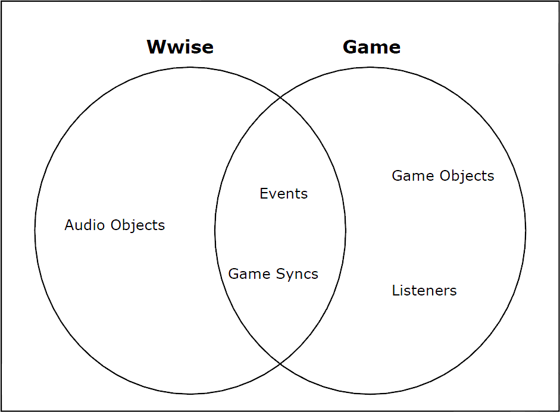

# Wwise 基础知识 (13) 结论

目录

- 结论

结论
自问世以来，Wwise 一直试图划清声音设计师和程序员之间的角色分工。他们各有所
长，应该让他们都能各显神通，全面提升游戏音频，增强整体的游戏体验。

Wwise 的核心由五个主要组件构成，通过这些组件来划分任务：

- Audio object（音频对象）
- Event（事件）
- Game Sync（游戏同步体）
- Game Object（游戏对象）
- Listener

每个组件被分别划分到声音设计师或程序员的职责范围内，如下图所示。

Event 和 Game Sync 是 Wwise 和游戏中都不可分割的两个组件。这两个组件在游戏中负责驱动音频，在 Wwise 的音频素材和游戏中的组件之间架起必要的桥梁。

Wwise 标志着电子游戏的音频开发和集成方式发生了根本性的变化。虽然它要求游戏设计师和开发人员采用全新的工作方式，但可以帮助他们更加高效地工作，并专注于
各自的专业领域。

至此您已基本了解了 Wwise 的游戏音频开发方式，现在您可以放开手脚，充分利用 Wwise 提供的所有功能了。
