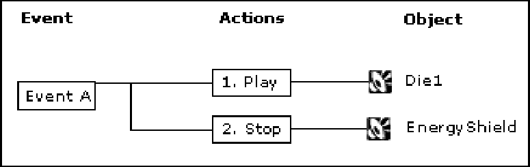
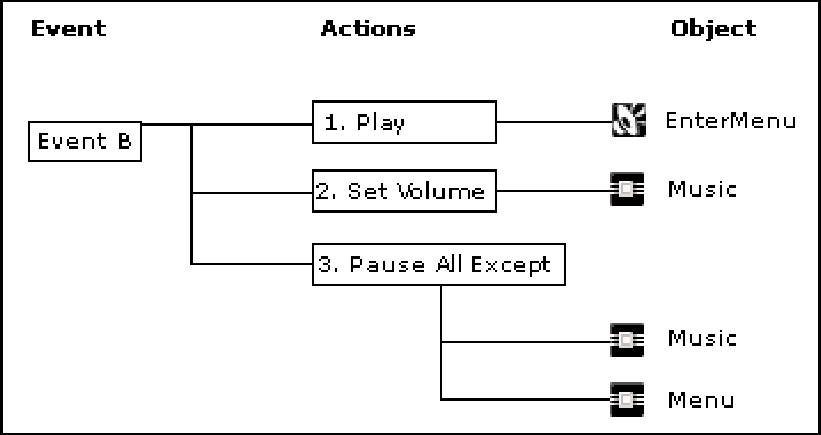
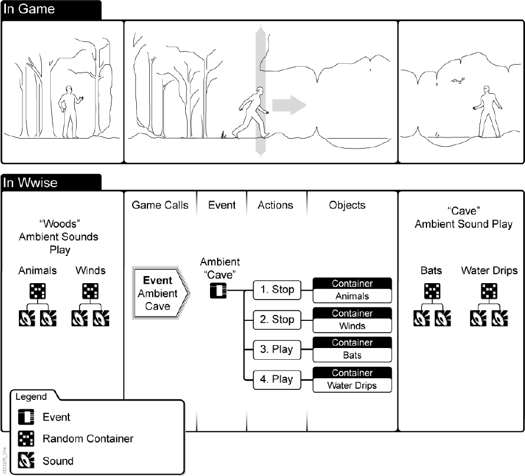
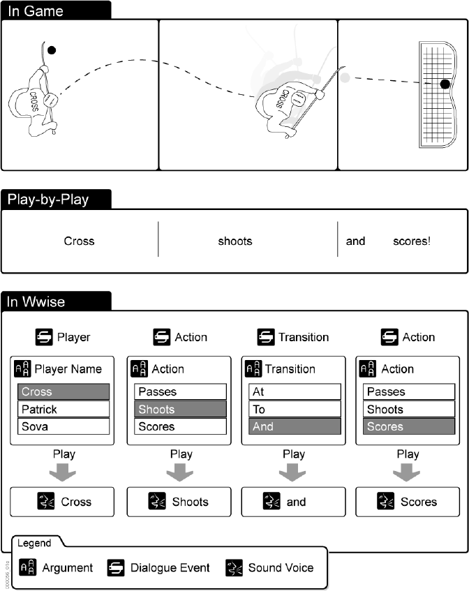

# Wwise 基础知识 (4) 理解 Event

目录

- 理解事件
- 动作事件
- 对白事件
- 定义事件作用范围
- 将事件集成到游戏中
- 使用 Wwise 事件的好处
- Event——角色和职责

## 理解 Event
Wwise 使用 Event（事件）驱动游戏中的音频。这些 Event 将Action（动作）应用于工程层级结构中的不同声音对象或对象组。您选择的动作用于指定 Wwise 对象是否播放、停止、暂停等。例如，假设您正在研发一款第一人称射击游戏，想要创建一个在玩家被打死时使用的事件。此事件将播放一个特殊的“Die”（死亡）声音，并停止当前正在播放的“EnergyShield”（能量护盾）声音。

下图演示了此 Event 在 Wwise 中如何工作：

声音设计师可以从长串的动作类型列表中选择一个动作类型来驱动游戏中的音频，包括 Mute（静音）、Set Volume（设定音量）和 Enable Effect Bypass（启用效果旁通）
等。例如，假设您创建了当玩家退出游戏进入菜单时使用的第二个 Event。此 Event将播放“Enter_Menu”（进入菜单）声音，将音乐总线音量减小 10dB，并暂停其他一切声音。

下图演示了此 Event 在 Wwise 中如何工作。

为了满足尽可能多的情况，Event 分为两种不同的类型：

- **Action Event（动作事件）**——这些 Event 使用一个或多个动作（例如播放、停
止、暂停等）来驱动游戏中的声音、音乐和振动。
- **Dialogue Event（对白事件）**——这些事件使用一种带参数的决策树来动态地确定
被播放的对象。

在 Wwise 中创建 Event 后，可以将它们集成到游戏引擎中，以在游戏中的恰当时间调
用它们。Event 可以在开发流程的初期阶段创建并集成到游戏引擎中。您可以继续优
化 Event，而无需将它重新集成到游戏引擎中。

## 动作事件
Wwise 使用“动作”事件（Action Event） 驱动游戏中的声音、音乐和振动。这些 Event 将动作应用于工程层级结构中的不同结构。每个 Event 都可以包含一个或一系列动作。用户选择的动作指定 Wwise 对象是否将播放、暂停、停止等。

### Example 4.1. 使用 Action Event——示例

假设游戏中的角色必须进入洞穴获取一些隐藏的文件。当该角色从树林进入洞穴时，游戏中的环境声音应发生改变。要触发此改变，必须创建一个包含一系列动作的 Event，这一系列动作将停止“Woods”（树林）环境声音并放“Cave”（洞穴）环境声音。此 Event 将被集成到游戏引擎中，当该角色进入洞穴时，游戏引擎就会调用您在 Wwise 中创建的特定 Event。

下图演示了游戏引擎如何触发 Event 来更改游戏中正在播放的环境声音：

为了处理声音、音乐或振动（motion）对象之间的过渡段，每个 Event 动作还拥有一组参数，您可以使用这些参数延迟或者淡入淡出来衔接前后的对象。

## 对白事件
Wwise 使用 Dialogue Event（对白事件） 来驱动游戏中的动态对白。Dialogue Event 基本上是一组决定播放哪条对白的规则或条件。Dialogue Event 可用于重新创建游戏中存在的各种不同场景、条件或结果。为了确保用户能够覆盖所有情形，Wwise 还允许用户创建默认或备用条件。

所有这些条件都使用一系列参数和参数值进行定义。这些参数和参数值组合起来构成用于定义游戏中各种特定条件或结果的参数路径。每条路径再与 Wwise 中的特定声音对象相关联。在游戏中调用 Dialogue Event 时，游戏根据 Dialogue Event 中设定的条件对现有条件进行验证。与游戏当前情形匹配的条件或参数路径将决定播放哪条对白。

### 小贴士
虽然创建 Dialogue Event 的初衷是处理游戏对白，但它们并非仅限于为对白所用，还可用于游戏中的很多其它场合。

### Example 4.2. 使用 Dialogue Event——示例
假设您正在创建一款配有实况解说的曲棍球游戏。当球员射门得分时，您希望实况解说能够与游戏中的动作一致。为了在 Wwise 中建立不同的可能性和结果，您需要为解说词中的 Players（球员）、Actions（动作）、Transitions（连接词）等句子成分创建 Dialogue Event。其中的每个 Event 都包含一组您为游戏所创建的相应参数和参数值。您必须创建用于定义每个条件或结果的参数路径，然后将相应的语音对象指定给每个参数路径。在游戏期间，游戏将对当前参数值与您在 Wwise 中定义的参数路径进行匹配，以此确定播放哪个语音对象。

下图演示了 Wwise 中创建的 Dialogue Event 如何能够生成实况解说“克劳斯（Cross，人名）射门，进球了！”：

## 定义 Event 作用范围
Event 中的每个动作都有相应的作用范围设置。作用范围确定 Event 动作是应用于全局所有Game Object还是触发该事件的特定Game Object。对于某些动作，声音设计师可以选择作用范围，而另一些动作的范围是预先确定的。再次以 EventB 为例，每个 Event 动作的作用范围可为如下：

### Table 4.1. 定义 Event 作用范围

|Event 动作 |作用范围 |备注 |
| -------- | ------ | ---- |
|Play（播放）> Menu_Enter（进入菜单）|Game Object|因为播放 Event 总是由单一Game Object触发，所以作用范围设定为Game Object。|
|Set Volume（设定音量）> Music（音乐）|Global（全局）|因为 Set Volume 动作应用
于总线，而总线从本质上讲属于全局，所以范围设定为 Global。|
|Play（播放）> Menu_Enter（进入菜单）|Global（全局）|因为 Pause All Except 动作应用于音乐总线，而音乐总线从本质上讲属于全局，所以范围自动设定为 Global。|

下图演示了此 Event 在 Wwise 中如何工作。

### Note
作用范围是适用于 Wwise 中许多元素的一个重要概念。了解每个元素的作用范围可帮助您决定在不同的情形下使用哪个元素。

## 将 Event 集成到游戏中
在为游戏创建 Event 后，声音设计师可以将它们打包成 SoundBank（声音库）。然后将这些 SoundBank 加载到游戏中。在游戏中，游戏代码可以触发这些事件。例如，当玩家被杀后，通过触发相应事件来播放特殊的“Die”声音并停止播放“EnergyShield”声音。

为了将这些事件集成到游戏中，程序员必须指定对哪个Game Object执行事件动作。这通过发送各个事件来完成。当您希望更改音频时，应由游戏代码来发送事件。您可以使用字符串或 ID 来发送事件。

## 使用 Wwise 事件的好处
使用这种方法触发游戏声音的一个主要优势是声音设计师拥有更大的控制权和灵活性，无需任何额外的编程工作。所有事件由声音设计师在 Wwise 中创建，然后由程序员将它们集成到游戏中。在事件集成到游戏中后，声音设计师可以继续处理它们，更改或修改它们包含的动作或者它们所指向的对象。由于游戏仍将触发同一个事件，因此设计师所做的更改将在游戏中生效，无需开发人员额外加工，也无需重新编译代码。

## Event——角色和职责
下表说明与事件相关的哪些任务属于声音设计师的职责，哪些属于程序员的职责：

### Table 4.2. Event——角色和职责

|任务|声音设计师 （Wwise） |程序员（游戏代码/工具）|
|---|:---:|:---:|
|创建事件| # ||
|将事件动作指定给音频对象| # ||
|定义事件动作的作用范围|#||
|在游戏中发送事件||#|
