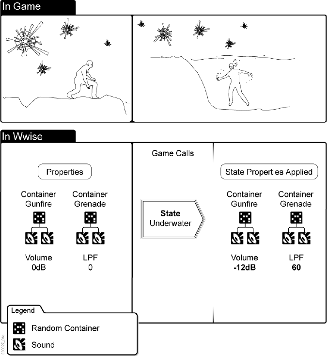
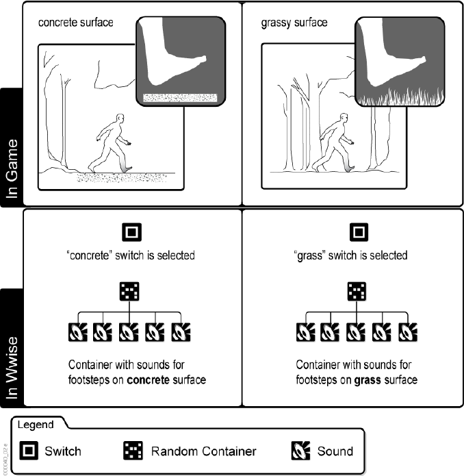
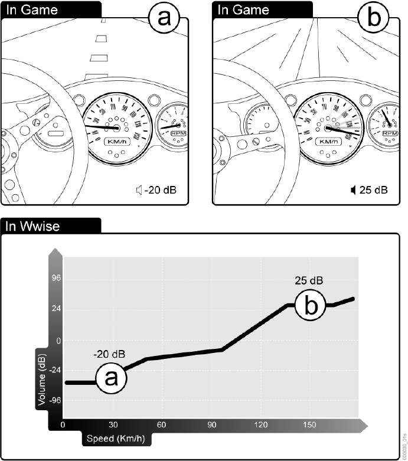
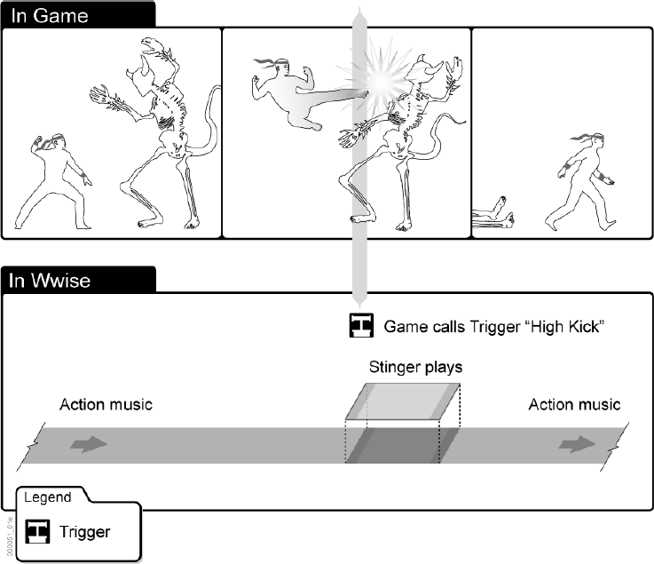

# Wwise 基础知识 (6) 什么是 Game Sync？

目录

- 什么是 Game Sync？
- 理解 State
- 理解 Switch
- 理解 RTPC
- 理解 Trigger
- Game Sync —— 角色和职责

## 什么是 Game Sync？
在完成初步的游戏设计后，您可以开始考虑如何使用被称为 Game Sync （游戏同步器）的 Wwise 元素来串接和处理互动音频中的变化和替换行为，这些行为也是游戏内容的一部分。您可以在五种不同的 Game Sync 类型中指明您所需要的类型，以配合提升游戏画面的质量，取得最佳的效果。

- **State（状态）**——游戏中发生的变化，将将在全局范围内影响现有音效、音乐或振
动（motion）的属性。
- **Switch（切换开关）**——为在不同条件下需要不同声音、音乐或振动的特定游戏元
素而提供的替换项。
- **RTPC（实时参数控制）**——以某种方式映射到可变游戏参数值的属性，使得游戏
参数值的改变将导致属性本身改变。
- **Trigger（触发器）**——对游戏中自发事件的响应，将启动插播乐句（ Stinger ）。
插播乐句是叠加在当前正在播放的音乐上并与之混音的简短乐句。

在构建游戏项目时，您必须兼顾应对质量需求、内存使用限制以及您所面临的时间约束。使用 Game Sync 可以从战略上简化您的工作，节省存储空间，帮助创建真正沉浸式的游戏体验。

***译注：Argument（参数）原为 Dynamic Dialogue 专用的 Game Sync，在 Wwise 2012.1 之后被去掉，改用 Switch 和 State 来完成同样的功能。***

## 理解 State
State 就如同“混音快照”，也即对游戏的音频和振动属性施加的全局偏置或调整，代表游戏中的物理和环境条件发生了变化。使用State可以简化设计音频和振动的方式，帮助您优化使用素材。

State 用作“混音快照”可以充分控制最终的声音输出，令其充满多层次的细节，并可与多种 State 组合，获得预期的结果。当一个对象上注册了多个 State 时，多个值的变化都可能会影响该对象的单个属性。在这种情况下，每个值的变化将累加在一起。例如，当两个不同State Group（状态组）中的两个状态都让音量产生了-6 dB 的变化，且两者同时起作用时，产生的最终音量将为 -12 dB。

当创建并定义这些“混音快照”时，您实际是在为音效、音乐或振动对象创建不同的属性集，但不会增加内存或磁盘空间的占用。这些属性集定义了特定状态下播放某音效所适用的一组规则。当您将这些属性上的更改在全局范围内施加到大量对象上时，就可以快速创建逼真的音景，更好地展现音频并提升游戏体验。通过更改已经在播放的音效、音乐或振动的属性，您可以复用素材，节省宝贵的内存空间。


### Example 6.1. 使用 State ——示例
假设您想模拟角色入水时的声音处理。在这种情况下，您可以使用 State（状态）来更改已经在播放的声音的音量和低通滤波器。这些属性改变会造成声音上的变化，当角色位于水下时再现枪声和手榴弹爆炸声的效果需要这种声音上的变化。

下图演示了当游戏调用水下状态时，将如何影响枪声和手榴弹爆炸声对象的音量和低通滤波器属性。

## 理解 Switch
在 Wwise 中，Switch（切换开关）代表游戏在不同条件下为特定 Game Object 提供的条件替换项。声音、音乐和振动对象被组织起来并指派给各个switch，从而当游戏中一个条件变为另一个条件时，都能够播放相应的音效或振动对象。指定给一个切换开关的各个 Wwise 对象被组合到一个 Switch Container（切换容器）中。当 Event（事件）发出改变信号时，切换容器确保开关被切换，并播放正确的声音、音乐或振动对
象。

### Example 6.2. 使用 Switch ——示例
假设您正在创建一款第一人称射击游戏。在游戏中，主人公可以行走和跑步通过各种不同的环境。每个环境中有不同的地面条件，例如混凝土地面、草地和泥土地面。您希望在每种地面上听到不同的脚步声。在这种情况下，您可以为不同地面创建 Switch，然后将不同的脚步声指定给适当的 Switch。当主人公在混凝土地面上行走时，“混凝土”这个 Switch 将被激活，并将播放其相应的音效。如果主人公接着从混凝土地面来到草地上，“草地”这个 Swtich 将被激活，并将播放它相应的音效。

下图演示了激活的切换开关如何确定播放哪个脚步声。

## 理解 RTPC
实时参数控制 （RTPC） 用于根据游戏中发生的实时参数值变化，来实时编辑特定的对象属性。通过使用 RTPC，您可以将游戏参数映射到属性值，并“自动执行”属性更改，增强游戏的真实感。参数值以坐标图视图形式显示，其中，一条轴表示 Wwise 中的切换开关组或属性值，另一条轴表示游戏中的参数值。通过将属性值映射到游戏参数值，您将创建一条定义两个参数之间总体关系的 RTPC 曲线。您可以创建任意数量的曲线，为游戏玩家创造丰富的沉浸式体验。

### Example 6.3. 使用 RTPC——示例
假设您正在创建一款赛车游戏。发动机声音的音量和音高需要随着赛车速度和 RPM（每分钟转速）的上升和下降而波动。在这种情况下，您可以使用 RTPC 将赛车发动机的音高和音量电平值映射到游戏中汽车的速度和 RPM 值上去。当赛车加速时，音高和音量属性值将根据它们的映射方式来做出反应。

下图演示了游戏中的赛车速度如何根据 Wwise 中的映射方式来影响音量。

## 理解 Trigger
与所有 Game Sync 一样，Trigger（触发器）也是一个 Wwise 元素，游戏先对它进行调用，然后在 Wwise 中根据游戏中发生的事件来定义合适的反馈方式。更具体地说，在互动音乐中，触发器响应游戏中的自发事件，并启动Stinger（插播乐句）。Stinger 是叠加在正在播放的音乐上并与之混音的简短乐句，也是以音乐的方式对游戏所做出的反应。例如，当一个忍者拔出武器时，您可以在已在播放中的动作音乐上插入强调类型的音乐效果，以增加场景的感染力。游戏将调用Trigger，然后 Trigger 将启动插播乐句，于是在正在播放的配乐之外将播放一段音乐片段。

### Example 6.4. 使用 Trigger ——示例
假设您创建了一款格斗游戏，主人公是一位忍者斗士。在游戏的多个位置，主人公将进入战斗模式，与敌人格斗。当主人公施展强力疾风腿时，您希望设置一段音乐，加强场景的听觉感染力。为了为这些游戏动画序列创建音乐，您需要创建一个 Trigger，可将它命名为“强力疾风腿”，供在游戏中的对应位置调用。另外，您需要定义这一小段音乐来提供疾风声，增加“飞踢”效果。

下图演示了在游戏的关键时刻播放插播乐句的触发器机制。

## Game Sync —— 角色和职责
下表说明与 Game Sync 相关的哪些任务属于声音设计师的职责，哪些属于程序员的职
责：

### Table 6.1. Game Sync ——角色和职责
|任务|声音设计师 （Wwise）| 程序员（游戏代码/工具）|
|---|:---:|:---:|
|创建Switch Group 和 Switch|#||
|创建State Group 和 State|#||
|定义State Transition Time（状态过渡时间）|#||
|为 Switch 和 State Group 注册 Swtich Container|#||
|设置 Trigger|#||
|将游戏引擎的 State 和 Switch 信息发送至 Wwise 音频引擎||#|
